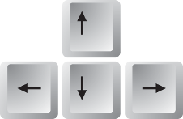

Frogger Game
===============================

Fun Fun Fun!

# v0.2

## About
Frogger Game is a web game, an Andela project created using HTML, CSS, javaScript (and you can play the game [here](http://)).

Author [Akinjide Bankole](https://twitter.com/JideBhanks)

## Fixed Bugs
Added Instructrions to ReadMe

## Showcase Demo
View the gh-page  [showcase demo](http://JideBhanks.github.io/) to see the page in action. The showcase provides a full preview of the project.

## How To Use And Interface
This Game is simpler than it looks.

In the game you'll control characters, named Warriors.  
(images/char-cat-girl.png)(images/char-horn-girl.png)(images/char-pink-girl.png)(images/char-princess-girl.png)  
Their names are **Warriors**.  You'll use the **arrow keys**...  

  

...to move Warriors around the map, trying to get each level's **key**.  

## Browser Support
Works in (Chrome) but have not be tested with other modern browser.